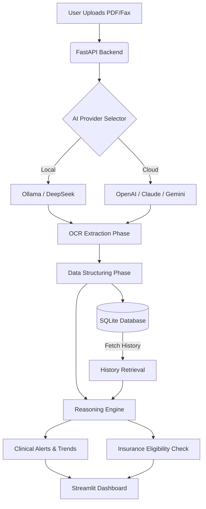

# 🏥 MediScan: AI Medical Record Digitizer & Decision Support


**MediScan** is a next-generation healthcare tool designed to bridge the gap between paper records and digital interoperability. It uses advanced AI to convert scanned medical PDFs, faxes, and images into structured, analyzable JSON data. Beyond simple digitization, MediScan acts as a Clinical Decision Support System (CDSS), running logic engines to detect health trends, flag inconsistencies, and verify insurance eligibility in real-time.

> **🔒 Privacy First:** MediScan is designed to run **100% locally** using Ollama, ensuring PHI (Protected Health Information) never leaves your infrastructure unless you explicitly opt-in to cloud providers.

---

## 🚀 Key Features

### 1. 📄 Intelligent Digitization (The Eye & The Clerk)
- **DeepSeek OCR:** Utilizes specialized OCR models to accurately transcribe complex medical forms and handwritten notes.
- **Smart Structuring:** Converts unstructured raw text into standardized, FHIR-ready JSON schemas (Patient Demographics, Medications, Vitals).
- **Human-in-the-Loop:** A dedicated validation UI displays the original PDF alongside the editable extracted data for rapid verification.

### 2. 🧠 Clinical Decision Support (The Brain)
- **Longitudinal Trend Analysis:** Automatically retrieves patient history from the local database to detect changes over time (e.g., *"Blood Pressure has increased by 15% compared to last visit"*).
- **Safety Consistency Checks:** Cross-references prescribed medications with diagnosed conditions to flag potential discrepancies.
- **Triage Alerts:** Generates "Traffic Light" warnings (🔴 Critical, 🟡 Warning, 🟢 Stable) for immediate clinician attention.

### 3. 🛡️ Automated Insurance Adjustment (The Adjuster)
- **Coverage Verification:** Upload an insurance policy document alongside the clinical record.
- **Clause Analysis:** The AI analyzes inclusion/exclusion clauses against the specific diagnosis to estimate eligibility and identify missing documentation.

### 4. 🔌 Universal AI Adapter (BYOK - Bring Your Own Key)
- **Local Mode (Default):** Runs completely free and private with Ollama models (`deepseek-ocr`, `glm-4`, `lfm2.5-thinking`).
- **Cloud Mode:** Seamlessly switch to **OpenAI (GPT-4o)**, **Anthropic (Claude 3.5 Sonnet)**, or **Google (Gemini 1.5)** for complex reasoning tasks that require state-of-the-art capabilities.

---

## 🛠️ Architecture Pipeline



---

## 📦 Installation

### Prerequisites
*   **Python 3.10+**
*   **[Ollama](https://ollama.com/)**: Required for local model execution.
*   **Poppler**: Required for PDF processing (`pdf2image`).

#### Installing Poppler
*   **Windows:** [Download Binary](https://github.com/oschwartz10612/poppler-windows/releases/), extract, and add the `bin/` folder to your System PATH.
*   **Mac:** `brew install poppler`
*   **Linux:** `sudo apt-get install poppler-utils`

### Setup Steps

1.  **Clone the Repository**
    ```bash
    git clone https://github.com/yourusername/mediscan-ocr.git
    cd mediscan-ocr
    ```

2.  **Install Python Dependencies**
    ```bash
    pip install -r requirements.txt
    ```

3.  **Pull Local AI Models**
    Ensure Ollama is running, then pull the required models:
    ```bash
    ollama pull deepseek-ocr
    ollama pull glm-4.7-flash
    ollama pull lfm2.5-thinking
    ```

---

## 🏃‍♂️ Usage Guide

### 1. Start the Backend (API)
The FastAPI backend handles file processing, database interactions, and AI orchestration.
```bash
python -m uvicorn backend.main:app --reload --port 8000
```

### 2. Start the Frontend (Dashboard)
Open a new terminal to launch the Streamlit user interface.
```bash
streamlit run frontend/app.py
```

### 3. Workflow
1.  **Configuration:** Open the **Settings Sidebar** and choose your AI Provider (default is "Ollama" for local privacy).
2.  **Upload:** Upload a scanned medical report (PDF or Image).
3.  **Analyze:** Click "Analyze Document" to trigger the pipeline.
4.  **Review:**
    *   **Tab 1 (Extraction):** Correct any OCR errors in the editable JSON panel.
    *   **Tab 2 (Insights):** Review health trends and safety alerts generated by "The Brain".
    *   **Tab 3 (Analysis):** See a detailed breakdown of medications and diagnoses.
    *   **Tab 4 (Insurance):** Upload a policy document to check for coverage eligibility.

---

## 📂 Project Structure

```plaintext
mediscan-ocr/
├── backend/
│   ├── main.py          # FastAPI Entry Point
│   ├── extract.py       # OCR & Structuring Pipeline (The Eye & Clerk)
│   ├── logic.py         # Reasoning & Insurance Logic (The Brain & Adjuster)
│   ├── database.py      # SQLite Database Manager (The Memory)
│   ├── ai_wrapper.py    # Universal Adapter (Ollama/OpenAI/Anthropic/Gemini)
│   ├── models.py        # Pydantic Data Schemas
│   └── uploads/         # Temporary storage for processing
├── frontend/
│   └── app.py           # Streamlit User Interface
├── requirements.txt     # Python Dependencies
└── README.md            # Project Documentation
```

---

## 🤝 Contributing
Contributions are welcome! Please open an issue to discuss proposed changes or submit a Pull Request.

## 📄 License
This project is licensed under the MIT License.
