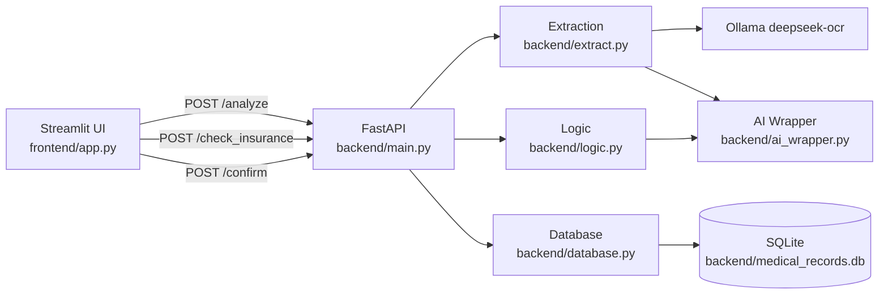
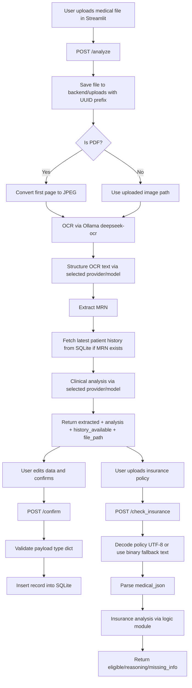

# MediScan OCR

Implementation-accurate documentation for the current repository.

For a concise startup guide, see `README.quickstart.md`.

## Documentation

- **Quickstart:** `README.quickstart.md` (minimal setup and run flow)
- **Full Technical Reference:** `README.md` (architecture, system flow, modules, limits)

## 1) Project Overview

MediScan OCR is a two-tier application:
- A FastAPI backend that ingests medical documents, extracts structured data, performs AI-driven analysis, checks insurance eligibility, and stores confirmed records.
- A Streamlit frontend that provides upload, review/edit, analysis display, and insurance check workflows.

Based on the current code, the system provides:
- Document analysis via `POST /analyze`.
- Insurance eligibility assessment via `POST /check_insurance`.
- Record persistence via `POST /confirm`.
- SQLite-backed retrieval of the latest prior record by MRN for trend context.

## 2) Architecture Overview

### High-level design

- **UI layer:** `frontend/app.py` (Streamlit).
- **API layer:** `backend/main.py` (FastAPI endpoints and request orchestration).
- **Extraction pipeline:** `backend/extract.py` (PDF/image handling + OCR + JSON structuring).
- **Reasoning layer:** `backend/logic.py` (clinical analysis and insurance analysis).
- **Provider adapter:** `backend/ai_wrapper.py` (Ollama/OpenAI/Gemini/Anthropic text generation interface).
- **Persistence:** `backend/database.py` (SQLite create/insert/select).

### Component interaction



## 3) System Flow

### A. Analyze document (`POST /analyze`)

1. Frontend posts file + `provider` + `model` + `api_key` form fields.
2. Backend stores the uploaded file under `backend/uploads/` using `basename(filename)` and a UUID prefix.
3. Backend runs `process_document_pipeline(file_path, provider, model, api_key)`.
4. Pipeline behavior:
   - If file is PDF, converts first page only to JPEG (`first_page=1`, `last_page=1`).
   - Runs OCR via `ollama.chat(model='deepseek-ocr', ...)`.
   - Sends OCR text to `get_ai_response(...)` for JSON structuring.
5. Backend reads `patient.mrn` from extracted JSON and fetches latest matching history (`ORDER BY date DESC LIMIT 1`) if MRN exists.
6. Backend runs `analyze_medical_logic(current_data, past_data, provider, model, api_key)`.
7. Response includes `extracted`, `analysis`, `history_available`, and `file_path`.

### B. Insurance check (`POST /check_insurance`)

1. Frontend posts `policy_file` and `medical_json` (stringified extracted data).
2. Backend reads policy bytes and attempts UTF-8 decode.
3. On decode failure, backend substitutes fixed text: `Binary PDF content - (Simulated OCR would go here)`.
4. Backend parses `medical_json` with `json.loads`; invalid JSON returns HTTP 400.
5. Backend calls `check_insurance_coverage(medical_data, policy_text)` (default provider/model in function signature).
6. Returns insurance analysis payload.

### C. Confirm record (`POST /confirm`)

1. Frontend sends edited JSON from `st.data_editor`.
2. Backend validates payload is a JSON object (`dict`), otherwise HTTP 422.
3. Backend persists record using `save_record(data)`.
4. Returns `{"status": "saved"}`.

### End-to-end flow diagram



## 4) Workflow / Agent Logic

The codebase does **not** implement a graph/workflow engine with explicit nodes, state machine transitions, retries, or conditional routers.

Current orchestration is direct function chaining in endpoint handlers:
- `/analyze` chains file save → extraction pipeline → history lookup → analysis.
- `/check_insurance` chains policy read/decode → JSON parse → insurance logic.
- `/confirm` chains payload validation → database write.

Retry behavior is not implemented explicitly; failures are handled by exception guards that return error payloads or HTTP errors.

## 5) Data Model / State Structure

### A. Structured medical record payload (runtime JSON contract used by extraction/logic/database)

| Key | Type | Purpose |
|---|---|---|
| `patient.full_name` | string | Patient name |
| `patient.dob` | string (`YYYY-MM-DD`) | Date of birth |
| `patient.mrn` | string | Patient identifier for history lookup |
| `encounter.date` | string (`YYYY-MM-DD`) | Encounter date used in DB sorting |
| `encounter.provider` | string | Provider name |
| `encounter.facility` | string | Facility name |
| `clinical.diagnosis_list` | array[string] | Diagnoses |
| `clinical.medications` | array[object] | Medication entries (`name`, `dosage`, `frequency`) |
| `clinical.vitals` | object | Vitals dictionary (e.g., bp/hr/temp/weight) |

### B. Backend response shapes

- `/analyze` response keys: `extracted`, `analysis`, `history_available`, `file_path`.
- `/check_insurance` expected keys from logic prompt/output: `eligible`, `confidence`, `reasoning`, `missing_info`.
- `/confirm` response: `{"status": "saved"}`.

### C. Frontend session state (`st.session_state`)

| Key | Initial value | Purpose |
|---|---:|---|
| `extracted_data` | `None` | Holds extracted JSON for editing and downstream operations |
| `analysis` | `None` | Holds analysis payload for insights panels |
| `pdf_path` | `None` | Holds backend file path used for preview |

### D. Pydantic models (`backend/models.py`)

Defined models: `Patient`, `Encounter`, `ClinicalData`, `MedicalRecord`.

Notes from implementation:
- `MedicalRecord` includes optional `encounter` and optional `encounter_date`.
- These models are tested but not currently enforced on FastAPI endpoint payloads.

## 6) Core Modules Breakdown

### `backend/main.py`

| Function | Purpose | Inputs | Output / Behavior |
|---|---|---|---|
| `analyze_medical_doc` | End-to-end document analysis endpoint | Multipart file + form fields (`provider`, `model`, `api_key`) | Saves upload, runs extraction + analysis, returns combined JSON; raises HTTP 500 if extraction returns `{"error": ...}` |
| `check_insurance` | Insurance eligibility endpoint | Multipart `policy_file`, form `medical_json` | Decodes policy text, parses medical JSON, calls insurance logic; raises HTTP 400 on invalid JSON |
| `confirm_record` | Record persistence endpoint | JSON object (`dict`) | Persists via `save_record`; raises HTTP 422 if payload is not a JSON object |

### `backend/extract.py`

| Function | Purpose | Inputs | Output / Behavior |
|---|---|---|---|
| `process_document_pipeline` | OCR + structuring pipeline | `file_path`, `provider`, `model`, `api_key` | PDF first-page conversion if needed; OCR via Ollama deepseek-ocr; structure via selected provider/model; returns structured dict or `{"error": ...}`; cleans temp JPEG in `finally` |

### `backend/logic.py`

| Function | Purpose | Inputs | Output / Behavior |
|---|---|---|---|
| `analyze_medical_logic` | Clinical trend/consistency reasoning | `current_data`, `past_data`, provider/model/api key | Calls AI wrapper with `REASONING_PROMPT`; returns parsed JSON or fallback `{"summary": "Analysis failed", "alerts": [], "trends": []}` |
| `check_insurance_coverage` | Coverage reasoning against policy text | `medical_data`, `policy_text`, provider/model/api key | Truncates policy text to 4000 chars in prompt; returns parsed JSON or fallback `{"eligible": False, "reasoning": "Error: ...", "missing_info": []}` |

### `backend/ai_wrapper.py`

| Function | Purpose | Inputs | Output / Behavior |
|---|---|---|---|
| `get_ai_response` | Provider abstraction | `provider`, `model`, `api_key`, `system_prompt`, `user_text` | Dispatches to Ollama/OpenAI/Gemini/Anthropic; returns provider text or error string (`Error with <provider>: ...`) |
| `clean_json_output` | JSON text cleanup | Raw model text | Removes code fences and extracts first `{...}` block via regex |

### `backend/database.py`

| Function | Purpose | Inputs | Output / Behavior |
|---|---|---|---|
| `init_db` | DB bootstrap | None | Creates `records(id, mrn, date, full_json)` if missing |
| `save_record` | Insert record | `data: dict` | Extracts `patient.mrn` + `encounter.date` (fallback `UNKNOWN`), inserts JSON blob |
| `get_patient_history` | Fetch latest prior record | `mrn: str` | Returns last `full_json` by `ORDER BY date DESC LIMIT 1`, else `None` |

## 7) Security Model

Implemented protections visible in code:
- Upload filename hardening in `/analyze` using `os.path.basename(...)` plus UUID prefix to avoid direct user-controlled path usage.
- `/confirm` requires JSON object payload type (`dict`) before write.
- `/check_insurance` validates `medical_json` with explicit JSON parse and returns HTTP 400 on invalid data.

Security-relevant constraints and gaps (as implemented):
- No authentication or authorization on any endpoint.
- CORS is open (`allow_origins=["*"]`).
- No content scanning or malware validation for uploaded files.
- No schema validation at API boundary using Pydantic request models.
- Insurance binary file handling uses placeholder fallback text rather than OCR.

## 8) LLM / Provider Integration

### Supported providers in code

`get_ai_response` supports:
- `Ollama`
- `OpenAI`
- `Gemini`
- `Anthropic`

Unsupported provider behavior:
- Returns: `Error with <provider>: Unsupported provider`.

### Model selection behavior

- Frontend sends selected `provider` + `model` + optional `api_key` only to `/analyze`.
- OCR step in extraction is fixed to `deepseek-ocr` via Ollama (not user-selectable).
- Structuring and clinical analysis in `/analyze` use frontend-selected provider/model.
- `/check_insurance` endpoint currently does not accept provider/model form fields, so `check_insurance_coverage` uses function defaults unless backend code is changed.

### Fallback behavior

- Provider call failures in `get_ai_response` return error strings.
- Downstream logic functions catch parse/runtime failures and return fallback JSON payloads.

## 9) Setup & Installation

### Prerequisites

- Python environment (venv recommended).
- Dependencies in `requirements.txt`.
- For PDF conversion: `pdf2image` requires Poppler binaries available on the host.

### Create and activate virtual environment

#### Windows (PowerShell)

```powershell
python -m venv .venv
.\.venv\Scripts\Activate.ps1
```

#### Windows (CMD)

```bat
python -m venv .venv
.venv\Scripts\activate.bat
```

### Install dependencies

```bash
python -m pip install --upgrade pip
python -m pip install -r requirements.txt
```

### Optional: ensure test dependencies

```bash
python -m pip install pytest pytest-cov httpx
```

## 10) Running the Application

### Start backend API

```bash
python -m uvicorn backend.main:app --reload --port 8000
```

### Start frontend UI

```bash
streamlit run frontend/app.py
```

### What the user sees

The Streamlit UI provides four tabs:
- **Extraction & Validation**: document preview + editable extracted data + save action.
- **AI Insights Panel**: alerts, trend metrics, and summary from analysis payload.
- **Deep Analysis**: medication table and diagnosis list from extracted clinical data.
- **Insurance Eligibility**: policy upload + eligibility check output.

## 11) Testing

### Framework and configuration

- Test framework: `pytest`.
- Config file: `pytest.ini`.
- Configured options: `testpaths = tests`, `--cov=backend`, `--cov-report=term-missing`.

### Run tests

```bash
python -m pytest
```

### Repository test evidence

`TEST_REPORT.md` records a full-suite run with 34 passing tests and backend coverage metrics.

## 12) Limitations

Code-grounded constraints in the current implementation:
- OCR engine is fixed to Ollama `deepseek-ocr` in extraction.
- PDF processing uses first page only.
- Binary/non-UTF8 policy documents are not OCR-processed; fallback placeholder text is used.
- Frontend preview depends on local filesystem access to backend `file_path`.
- Historical lookup returns latest row sorted by text `date` field.
- No explicit retry/backoff mechanism for provider/API failures.
- No endpoint authentication/authorization.

## 13) Future Improvements (code-implied)

The following are direct extensions of current constraints:
- Add provider/model selection support to `/check_insurance` (similar to `/analyze`).
- Introduce request-body Pydantic models on API endpoints for stronger schema validation.
- Replace policy binary fallback with actual OCR extraction path.
- Support multi-page PDF extraction where clinical information spans multiple pages.
- Tighten CORS and add authentication for non-local deployments.

## Project Structure

```text
mediscan-ocr/
├─ backend/
│  ├─ ai_wrapper.py
│  ├─ database.py
│  ├─ extract.py
│  ├─ logic.py
│  ├─ main.py
│  ├─ models.py
│  └─ uploads/
├─ frontend/
│  └─ app.py
├─ tests/
│  ├─ integration/
│  └─ unit/
├─ pytest.ini
├─ requirements.txt
└─ TEST_REPORT.md
```
