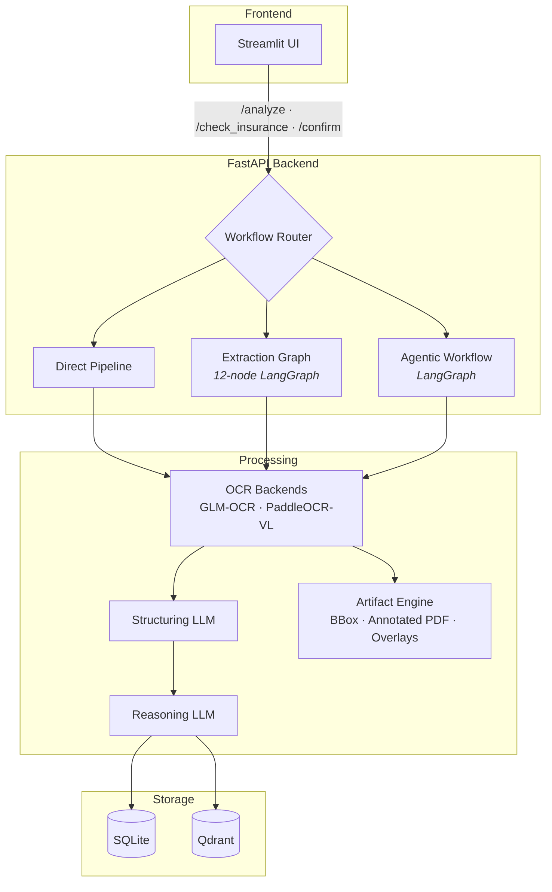

<div align="center">

# MediScan OCR

**Intelligent Clinical Document Processing & Decision Support**

[](https://python.org)
[](https://fastapi.tiangolo.com)
[](https://streamlit.io)
[](https://langchain-ai.github.io/langgraph/)
[-brightgreen)]()
[]()

[Quick Start](#quick-start) &middot; [Architecture](#architecture) &middot; [Usage Guide](USAGE.md) &middot; [API Reference](#api-reference) &middot; [Handbook](docs/HANDBOOK.md) &middot; [Roadmap](#roadmap)

</div>

---

## What is MediScan OCR?

MediScan OCR is a **clinical decision-support system** that turns unstructured
medical documents (PDFs, scanned images, lab reports, insurance policies) into
**validated, machine-readable clinical records**. It combines pluggable OCR
engines, LLM-powered structuring, graph-based extraction workflows, and
semantic retrieval to produce auditable, correctable output that downstream
CDS pipelines can consume.

It ships as a single FastAPI service plus a Streamlit operator UI. Every
component is replaceable; nothing about the OCR engine, the LLM provider, or
the vector store is hard-coded into the request handlers.

## Why use it?

| Pain point | MediScan's answer |
|---|---|
| Paper and PDF clinical records are unusable for downstream analytics | OCR + LLM structuring produce a typed `MedicalRecord` (Pydantic v2) that round-trips through SQLite. |
| LLM outputs are noisy and frequently off-schema | A 12-node LangGraph runs extract → validate → normalize → confidence-gate, and routes low-confidence documents to a human-review queue. |
| Clinicians need to compare today's record against prior encounters | SQLite + Qdrant retrieval give the reasoning LLM structured history and semantic context by patient MRN. |
| Insurance eligibility is a separate workflow | `/check_insurance` ingests a policy (TXT or PDF), chunks it, and reasons over extracted diagnoses with explainable verdicts. |
| PHI must never leak to logs or external services | Structlog redacts sensitive keys + provider tokens; HMAC-peppered MRN hashing replaces raw identifiers; a prompt firewall wraps every untrusted document section in nonce-delimited blocks. |
| Multiple OCR engines are needed for different document types | GLM-OCR (default, Ollama) and PaddleOCR-VL (local Python or HTTP service) are hot-swappable per request. |
| Reasoning quality should be reproducible | Capture-and-embed lineage (git SHA, library versions, OCR/LLM identifiers) on every record and audit event. |

## How it works


```mermaid
flowchart TB
    subgraph Frontend
        UI[Streamlit UI]
    end

    subgraph API ["FastAPI Backend"]
        direction TB
        ROUTER{Workflow Router}
        DIRECT[Direct Pipeline]
        GRAPH[Extraction Graph<br/><i>12-node LangGraph</i>]
        AGENTIC[Agentic Workflow<br/><i>LangGraph</i>]
    end

    subgraph Processing
        direction TB
        OCR[OCR Backends<br/>GLM-OCR &middot; PaddleOCR-VL]
        STRUCT[Structuring LLM]
        REASON[Reasoning LLM]
        ART[Artifact Engine<br/>BBox &middot; Annotated PDF &middot; Overlays]
    end

    subgraph Storage
        direction TB
        SQLITE[(SQLite)]
        QDRANT[(Qdrant)]
    end

    UI -- "/analyze &middot; /check_insurance &middot; /confirm" --> ROUTER
    ROUTER --> DIRECT
    ROUTER --> GRAPH
    ROUTER --> AGENTIC

    DIRECT --> OCR
    GRAPH --> OCR
    AGENTIC --> OCR

    OCR --> ART
    OCR --> STRUCT --> REASON

    REASON --> SQLITE
    REASON --> QDRANT
```

For the complete zero-to-hero walkthrough (every subsystem, with code references
and example output shapes), see **[docs/HANDBOOK.md](docs/HANDBOOK.md)**. For
focused references, see [docs/ARCHITECTURE.md](docs/ARCHITECTURE.md),
[docs/SECURITY.md](docs/SECURITY.md), and
[docs/DEVELOPMENT.md](docs/DEVELOPMENT.md).

### Project Structure

```
├── backend/
│   ├── main.py                     # FastAPI app, routes, CORS, rate-limit, observability wiring
│   ├── security.py                 # API-key auth, upload validation, SSRF guard, prompt firewall
│   ├── logging_config.py           # Structlog + PHI-redacting log processors
│   ├── observability.py            # Prometheus + OTel hooks, request-ID middleware
│   ├── lineage.py                  # Commit SHA + dependency versions for audit payloads
│   ├── pii_scrub.py                # Optional Presidio-compatible PHI scrubber
│   ├── extract.py                  # Direct pipeline: OCR → structuring orchestration
│   ├── ocr.py                      # Thin OCR dispatch layer
│   ├── ocr_backends/
│   │   ├── base.py                 # OCRResult, OCRPageResult, OCRBoundingBox, abstract backend
│   │   ├── ollama_ocr.py           # GLM-OCR prompt templates, multi-page loop
│   │   ├── paddleocr_vl.py         # PaddleOCR-VL local Python + service modes
│   │   └── service_client.py       # HTTP client with healthcheck and timeout
│   ├── workflows/
│   │   ├── extraction_graph.py     # 12-node granular LangGraph extraction
│   │   └── agentic_extraction.py   # First-gen coarser LangGraph workflow
│   ├── retrieval/
│   │   ├── chunking.py             # Sliding-window text chunking
│   │   ├── embeddings.py           # Ollama embedding adapter
│   │   ├── vector_store.py         # Abstract vector store interface
│   │   ├── qdrant_store.py         # Qdrant implementation (active)
│   │   └── pgvector_store.py       # pgvector scaffold (not live)
│   ├── logic.py                    # Clinical reasoning + insurance logic (with prompt firewall)
│   ├── ai_wrapper.py               # Multi-provider LLM adapter (Ollama/OpenAI/Anthropic/Gemini)
│   ├── artifacts.py                # Page rendering, annotation drawing, manifest generation
│   ├── database.py                 # SQLite persistence + human-review queue
│   └── models.py                   # Pydantic domain models (MedicalRecord, etc.)
├── frontend/
│   └── app.py                      # Streamlit application
├── docs/
│   ├── HANDBOOK.md                 # Zero-to-hero walkthrough
│   ├── ARCHITECTURE.md             # System architecture reference
│   ├── SECURITY.md                 # Defense-in-depth model
│   └── DEVELOPMENT.md              # Tests, CI, dev workflow
├── tests/
│   ├── unit/                       # Module-level tests across backend/
│   ├── integration/                # FastAPI TestClient + live-stack (auto-skip)
│   └── eval/                       # Quality harness: metrics + gold fixtures (opt-in via -m eval)
├── requirements.txt                # Unpinned top-level declarations
├── requirements.lock.txt           # Fully resolved reproducible install
├── pytest.ini                      # Markers: live, eval
├── Dockerfile                      # Container image build
├── USAGE.md                        # Comprehensive usage guide
└── README.quickstart.md            # Minimal startup path
```

## Quick Start

```bash
# Clone
git clone https://github.com/pypi-ahmad/Clinical-Decision-Support-System.git
cd Clinical-Decision-Support-System

# Environment (uv-managed)
uv python install 3.12.10
uv venv --python 3.12.10
source .venv/bin/activate            # Linux / macOS
# .\.venv\Scripts\Activate.ps1       # Windows PowerShell

# Dependencies
uv sync --frozen

# Required env vars
export MEDISCAN_API_KEY="change-me-to-a-long-random-string"   # required by every data route
export MRN_HMAC_PEPPER="long-random-server-only-secret"       # required for retrieval / audit linkage
# Local dev only (skips auth — DO NOT set in production):
# export MEDISCAN_ALLOW_ANONYMOUS=1

# Launch
uv run --frozen uvicorn backend.main:app --reload --port 8000   # Terminal 1
uv run --frozen streamlit run frontend/app.py                    # Terminal 2
```

> **Prerequisites:** [Poppler](https://poppler.freedesktop.org/) for PDF rendering, [Ollama](https://ollama.com/) for local LLM inference. Pull the default OCR model with `ollama pull glm-ocr`. See [USAGE.md](USAGE.md) for PaddleOCR-VL and Qdrant setup.

## Extraction Workflows

MediScan supports three extraction modes, selectable per request.

### Direct Pipeline

Single-pass execution: OCR → structuring LLM → reasoning LLM. Lowest latency, suitable for high-confidence document types.

### Granular Extraction Graph

The default and recommended mode. A 12-node LangGraph with typed `ExtractionGraphState`, providing full per-node observability and conditional routing.

```
ingest → classify → split → ocr → extract → validate → normalize → retrieve → merge → confidence_gate ─┬─→ persist
                                                                                                         └─→ human_review → persist
```

| Node | Responsibility |
|---|---|
| `ingest_document` | Verify file exists and is readable |
| `classify_document_type` | Heuristic document type classification from filename |
| `split_pages` | Pre-stage for multi-page documents |
| `ocr_per_page` | Run the selected OCR backend across all pages |
| `extract_candidate_fields` | Structuring LLM call to produce JSON fields |
| `validate_against_schema` | Validate output against `MedicalRecord` Pydantic schema |
| `normalize_codes` | Normalize ICD codes, diagnosis punctuation, medication casing |
| `retrieve_context` | Load SQLite history + Qdrant vector context |
| `merge_document_record` | Reasoning LLM call with combined context |
| `confidence_gate` | Score confidence; route to human review if below threshold |
| `human_review` | Enqueue a review task in SQLite (exposed via `/review/*`) |
| `persist_record` | Index document chunks to the vector store |

### Agentic Workflow

First-generation LangGraph implementation with coarser composite nodes. Available for backward compatibility.

## OCR Backends

All backends produce a unified `OCRResult` with per-page text, optional markdown, structured output, and bounding boxes.

| Backend | Engine | Bounding Boxes | Prompt Modes | Default |
|---|---|---|---|---|
| **GLM-OCR** | Ollama | &mdash; | text &middot; table &middot; figure &middot; formula &middot; chart | **Yes** |
| PaddleOCR-VL (local) | PaddlePaddle | Yes | &mdash; | &mdash; |
| PaddleOCR-VL (service) | HTTP client | Yes | &mdash; | &mdash; |

## Semantic Retrieval

Documents are chunked, embedded (Ollama `nomic-embed-text`), and indexed into Qdrant with metadata:

| Field | Purpose |
|---|---|
| `patient_id_hash` | HMAC-SHA256 of MRN for deterministic, privacy-preserving lookup |
| `source_type` | `medical_record` or `insurance_policy` |
| `encounter_date` | Temporal filtering |
| `page_number` | Page-level provenance |
| `ocr_backend` | Lineage tracking |

Vector search is **additive context**, not a replacement for the relational SQLite history lookup. Exact metadata filters are applied before similarity scoring.

## API Reference

All data routes require the `X-API-Key` header to match `MEDISCAN_API_KEY`. A request-scoped `X-Request-ID` header is accepted on ingress and echoed on every response (or auto-generated when absent).

| Endpoint | Method | Auth | Description |
|---|---|---|---|
| `/analyze` | POST | `X-API-Key` | Process a medical document through the selected extraction workflow |
| `/check_insurance` | POST | `X-API-Key` | Compare extracted diagnoses against an insurance policy |
| `/confirm` | POST | `X-API-Key` | Persist a confirmed medical record to SQLite |
| `/artifacts/{path}` | GET | `X-API-Key` | Stream a generated artifact (bounding-box overlay, annotated page, manifest) |
| `/review/pending` | GET | `X-API-Key` | List pending human-review tasks |
| `/review/{task_id}/approve` | POST | `X-API-Key` | Approve a queued review task |
| `/review/{task_id}/reject` | POST | `X-API-Key` | Reject a queued review task |
| `/health` | GET | &mdash; | Liveness probe |
| `/ready` | GET | &mdash; | Readiness probe (checks Ollama / Qdrant / compiled graphs) |
| `/metrics` | GET | `X-API-Key` | Prometheus scrape endpoint (only mounted when `MEDISCAN_PROMETHEUS=1`) |

### `POST /analyze`

| Parameter | Type | Default | Description |
|---|---|---|---|
| `file` | file | *required* | Medical document (PDF, JPG, PNG); magic-byte validated |
| `ocr_backend` | string | `glm` | OCR engine: `glm` (default), `ollama`, `paddle` |
| `ocr_mode` | string | `text` | Prompt mode (GLM only) |
| `structuring_provider` | string | `null` | Provider for the structuring LLM |
| `structuring_model` | string | `null` | Model for the structuring LLM |
| `structuring_api_key` | string | `null` | Per-request override; **accepted only when `MEDISCAN_ALLOW_USER_API_KEYS=1`**, otherwise the server-side env var (`OPENAI_API_KEY` / `ANTHROPIC_API_KEY` / `GEMINI_API_KEY`) is used |
| `reasoning_provider` | string | `null` | Provider for the reasoning LLM |
| `reasoning_model` | string | `null` | Model for the reasoning LLM |
| `reasoning_api_key` | string | `null` | Same opt-in rule as `structuring_api_key` |
| `extraction_graph_mode` | bool | `false` | Enable 12-node granular extraction graph |
| `agentic_mode` | bool | `false` | Enable first-gen agentic workflow |
| `use_gpu` | bool | `true` | GPU acceleration for PaddleOCR-VL |

> Full parameter reference and response schema in [USAGE.md](USAGE.md#api-reference).

### `POST /check_insurance`

Accepts `policy_file` (TXT or PDF) and `medical_json` (serialized extraction output). Set `policy_ocr=true` to OCR a PDF policy before reasoning. Supports the same provider/model split as `/analyze`.

### `POST /confirm`

Accepts a JSON body conforming to the `MedicalRecord` schema. Writes the confirmed record to SQLite.

## Testing

```bash
uv run --frozen pytest                     # Full suite with coverage (241 passed, 8 skipped — all live tests auto-skip without services)
uv run --frozen pytest tests/unit/         # Unit tests only
uv run --frozen pytest tests/integration/  # Integration tests only
uv run --frozen pytest -m eval             # Quality-evaluation harness (skips when no gold fixtures)
uv run --frozen pytest -k "extraction_graph" -v           # Filtered run
uv run --frozen pytest tests/integration/test_live_pipeline.py -v  # Live tests (require running services)
```

### Verification Tiers

Tests are organized into three tiers. **Mocked tests** exercise code paths with fakes and assertions — they validate logic correctness but do not prove that external services (Ollama, Qdrant, PaddleOCR) produce usable output. **Live-stack tests** call real services and are auto-skipped when the required backend is unreachable. **Quality evaluation** scores CER / field-level F1 / exact-match against JSON gold fixtures (skipped when the `tests/eval/gold/` directory is empty).

| Tier | Scope | Skip Condition |
|---|---|---|
| **Mocked (unit + integration)** | All nodes, serialization, config, schema, routing, security, observability | Never skipped |
| **Live (integration)** | Real Ollama OCR + structuring + reasoning, Qdrant index/search, multi-page PDF | Skipped when Ollama / Qdrant / PaddleOCR unreachable |
| **Eval (`-m eval`)** | Character / word error rate, field-set F1, MRN exact-match on gold fixtures | Skipped when `tests/eval/gold/*.json` is empty |

> **Important:** A green mocked-test suite does **not** prove end-to-end correctness. Run live-stack tests against real services to validate actual model output quality and retrieval recall.

Major test modules (per `tests/`):

- `tests/unit/` — `test_ai_wrapper.py`, `test_agentic_extraction.py`, `test_database.py`, `test_extract.py`, `test_extraction_graph.py`, `test_logic.py`, `test_main_unit.py`, `test_models.py`, `test_observability.py`, `test_ocr_backends.py`, `test_retrieval.py`.
- `tests/integration/` — `test_api_workflows.py` (FastAPI `TestClient`), `test_live_pipeline.py` (real Ollama + Qdrant, auto-skip).
- `tests/eval/` — `test_metrics.py` (metric-math correctness, runs by default), `test_extraction_quality.py` (gated on `-m eval`).

## Configuration

Environment variables grouped by concern. Defaults are shown where the code supplies one.

**Auth, uploads, and hardening**

| Variable | Default | Description |
|---|---|---|
| `MEDISCAN_API_KEY` | &mdash; | Shared secret required on every data route as `X-API-Key`. Must be set in production. |
| `MEDISCAN_ALLOW_ANONYMOUS` | `0` | Local-dev escape hatch: skips auth only when `MEDISCAN_API_KEY` is unset. |
| `MEDISCAN_ALLOW_USER_API_KEYS` | `0` | When `1`, `/analyze` accepts client-supplied `structuring_api_key` / `reasoning_api_key`; otherwise the server resolves keys from its own env vars. |
| `MRN_HMAC_PEPPER` | &mdash; | Server-held secret for HMAC-SHA256 hashing of MRNs. When unset, retrieval / audit linkage silently no-ops (never falls back to plain SHA-256). |
| `MEDISCAN_MAX_UPLOAD_BYTES` | `52428800` | Hard cap per upload (50 MiB). |
| `MEDISCAN_MAX_PDF_PAGES` | `200` | Reject PDFs with more pages than this. |
| `MEDISCAN_MAX_PIXELS` | `60000000` | Pillow decompression-bomb guard. |
| `MEDISCAN_MAX_RECORD_BYTES` | `262144` | Max serialized record size before persistence. |
| `MEDISCAN_RATE_LIMIT` | `1` | Set to `0` to disable slowapi. |
| `MEDISCAN_DEFAULT_RATE` | `60/minute` | slowapi default bucket per remote address. |
| `MEDISCAN_ALLOWED_ORIGINS` | `http://localhost:8501,http://127.0.0.1:8501` | Comma-separated CORS allow-list. |
| `MEDISCAN_ENABLE_DOCS` | `0` | Set to `1` to expose `/docs`, `/redoc`, `/openapi.json`. |
| `MEDISCAN_PII_SCRUB` | `0` | Opt-in PHI scrubber (Presidio-compatible). |

**Storage and retrieval**

| Variable | Default | Description |
|---|---|---|
| `MEDISCAN_DB_PATH` | `backend/records.db` | SQLite file location. |
| `MEDISCAN_UPLOAD_ROOT` | `backend/uploads` | Artifact / upload directory. |
| `MEDISCAN_RENDER_DPI` | `150` | PDF→PNG render DPI. |
| `VECTOR_STORE` | *(auto)* | Force `qdrant` or `pgvector`; default picks the first configured backend. |
| `QDRANT_URL` | `http://localhost:6333` | Qdrant endpoint. |
| `QDRANT_API_KEY` | &mdash; | Required whenever `QDRANT_URL` points off-host. |
| `QDRANT_ENABLED` | *(auto)* | Set to `1` / `true` to force-enable Qdrant. |
| `OLLAMA_EMBED_MODEL` | `nomic-embed-text` | Embedding model for document indexing. |

**LLM client**

| Variable | Default | Description |
|---|---|---|
| `OPENAI_API_KEY` / `ANTHROPIC_API_KEY` / `GEMINI_API_KEY` | &mdash; | Server-side provider credentials. |
| `MEDISCAN_LLM_TIMEOUT` | `120` | Per-provider request timeout in seconds (forwarded to OpenAI, Anthropic, Gemini, and Ollama SDK clients). |
| `MEDISCAN_LLM_RETRIES` | `3` | Tenacity `stop_after_attempt`. Transient-only: 4xx auth/validation errors are never retried. |
| `MEDISCAN_ANTHROPIC_MAX_TOKENS` | `4096` | Anthropic `max_tokens`. |

**Observability**

| Variable | Default | Description |
|---|---|---|
| `LOG_LEVEL` | `INFO` | Structlog / stdlib logging level. |
| `MEDISCAN_PROMETHEUS` | `0` | Set to `1` to mount the `/metrics` endpoint (requires `X-API-Key`). |
| `MEDISCAN_OTEL` | `0` | Set to `1` to enable OpenTelemetry FastAPI auto-instrumentation. |
| `MEDISCAN_GIT_SHA` | *(git)* | Overrides the commit SHA reported in lineage metadata. |

**Service URLs**

| Variable | Default | Description |
|---|---|---|
| `PADDLE_SERVICE_URL` | &mdash; | PaddleOCR-VL service-mode endpoint. Server-side only; never accepted from clients. |

## Known Limitations

- **Bounding boxes** &mdash; The Ollama-based OCR backend (GLM-OCR) does not emit native bounding boxes. The Annotated, Overlay, and Bounding Boxes tabs in the UI are **empty** for it. Bounding box artifacts require PaddleOCR-VL (local or service mode).
- **Semantic retrieval** &mdash; Qdrant retrieval is best-effort: if `QDRANT_URL` is unreachable or `MRN_HMAC_PEPPER` is unset, the retrieval path silently no-ops and contributes zero context. The API response includes `retrieval_enabled: false` when inactive.
- **pgvector** &mdash; Scaffolded but not live. `PgvectorRetrievalStore.is_configured()` returns `False` by default. Qdrant is the only actively exercised retrieval backend.
- **Patient history** &mdash; SQLite returns the latest prior record per MRN, not a full longitudinal timeline.
- **Human review** &mdash; `/review/pending`, `/review/{id}/approve`, and `/review/{id}/reject` expose a queue backed by SQLite. There is no external ticketing integration (e.g. Jira, ServiceNow); production deployments would need to plug that in.
- **Quality evaluation harness** &mdash; `tests/eval/` ships with metric implementations and correctness tests, but `tests/eval/gold/` is intentionally empty; contributors must add real gold JSON fixtures before `pytest -m eval` produces meaningful scores.
- **Evaluation breadth** &mdash; The current harness measures OCR (CER), structured fields (set-F1), and MRN exact-match only. Retrieval relevance and end-to-end reasoning quality are not yet scored.

## Roadmap

- [ ] Wire pgvector as a live retrieval backend with schema migration
- [ ] Integrate the review queue with an external ticketing system (Jira / ServiceNow / PagerDuty)
- [ ] Add ICD-10 code normalization via lookup table
- [ ] Introduce request-body Pydantic models for stronger API schema validation
- [ ] Add longitudinal patient history view (full timeline per MRN)
- [ ] Contribute gold fixtures under `tests/eval/gold/` and enable the `-m eval` harness in CI
- [ ] Extend the evaluation harness to retrieval relevance (recall@k / nDCG@k) and end-to-end reasoning quality
- [ ] Wire graph-node and LLM-token metrics through to Prometheus / OpenTelemetry exporters

## License

This project is provided as-is for research and development purposes.

---

<div align="center">

Built with [FastAPI](https://fastapi.tiangolo.com) &middot; [Streamlit](https://streamlit.io) &middot; [LangGraph](https://langchain-ai.github.io/langgraph/) &middot; [Qdrant](https://qdrant.tech) &middot; [Ollama](https://ollama.com)

</div>
