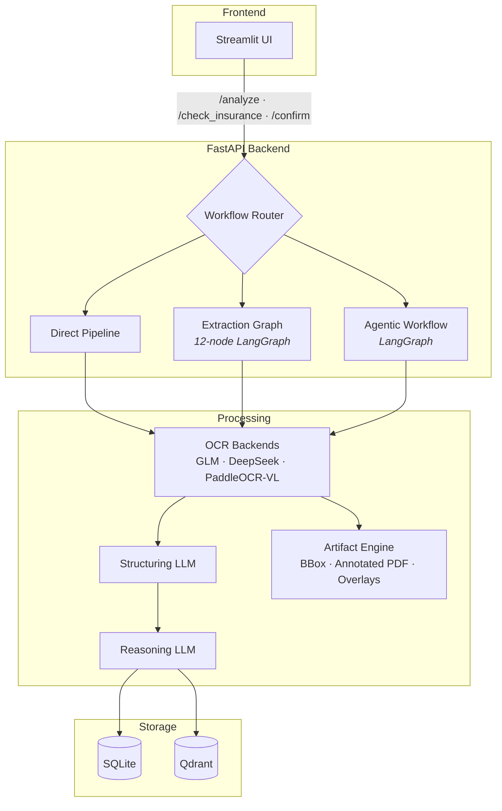

<div align="center">

# MediScan OCR

**Intelligent Clinical Document Processing & Decision Support**

[](https://python.org)
[](https://fastapi.tiangolo.com)
[](https://streamlit.io)
[](https://langchain-ai.github.io/langgraph/)
[]()
[]()

[Quick Start](#quick-start) · [Architecture](#architecture) · [Usage Guide](USAGE.md) · [API Reference](#api-reference) · [Contributing](#roadmap)

</div>

---

## Overview

MediScan OCR transforms unstructured medical documents into validated, machine-readable clinical records. It combines pluggable OCR engines, LLM-powered structuring, graph-based extraction workflows, and semantic retrieval to produce auditable, correctable output — bridging the gap between paper-based clinical data and downstream decision-support systems.

### Key Features

- **Multi-engine OCR** — Swap between GLM-4V, DeepSeek, and PaddleOCR-VL backends without changing application code.
- **Graph-based extraction** — A 12-node LangGraph pipeline (classify → OCR → extract → validate → normalize → retrieve → reason → gate) with typed state and full node-level observability.
- **Independent model routing** — Configure separate providers and models for OCR, structuring, and clinical reasoning within a single request.
- **Semantic retrieval** — Qdrant-backed vector search with exact metadata filters for cross-encounter context and policy clause retrieval.
- **Artifact generation** — Bounding box overlays, annotated PDFs/images, and downloadable audit artifacts.
- **Insurance verification** — Policy ingestion (text or OCR), semantic comparison against extracted diagnoses, and explainable eligibility reasoning.
- **Human-in-the-loop** — Confidence-gated review flags, inline data editing, and manual correction before persistence.

## Quick Start

```bash
# Clone
git clone https://github.com/pypi-ahmad/Clinical-Decision-Support-System.git
cd Clinical-Decision-Support-System

# Environment
python -m venv .venv && .venv\Scripts\Activate.ps1   # Windows
# source .venv/bin/activate                           # Linux / macOS

# Dependencies
pip install --upgrade pip && pip install -r requirements.txt

# Launch
python -m uvicorn backend.main:app --reload --port 8000   # Terminal 1
streamlit run frontend/app.py                              # Terminal 2
```

> **Prerequisites:** [Poppler](https://poppler.freedesktop.org/) for PDF rendering, [Ollama](https://ollama.com/) for local LLM inference. See [USAGE.md](USAGE.md) for PaddleOCR-VL and Qdrant setup.

## Architecture


```mermaid
flowchart TB
    subgraph Frontend
        UI[Streamlit UI]
    end

    subgraph API ["FastAPI Backend"]
        direction TB
        ROUTER{Workflow Router}
        DIRECT[Direct Pipeline]
        GRAPH[Extraction Graph<br/><i>12-node LangGraph</i>]
        AGENTIC[Agentic Workflow<br/><i>LangGraph</i>]
    end

    subgraph Processing
        direction TB
        OCR[OCR Backends<br/>GLM · DeepSeek · PaddleOCR-VL]
        STRUCT[Structuring LLM]
        REASON[Reasoning LLM]
        ART[Artifact Engine<br/>BBox · Annotated PDF · Overlays]
    end

    subgraph Storage
        direction TB
        SQLITE[(SQLite)]
        QDRANT[(Qdrant)]
    end

    UI -- "/analyze · /check_insurance · /confirm" --> ROUTER
    ROUTER --> DIRECT
    ROUTER --> GRAPH
    ROUTER --> AGENTIC

    DIRECT --> OCR
    GRAPH --> OCR
    AGENTIC --> OCR

    OCR --> ART
    OCR --> STRUCT --> REASON

    REASON --> SQLITE
    REASON --> QDRANT
```

### Project Structure

```
├── backend/
│   ├── main.py                     # FastAPI entry point, endpoint routing
│   ├── extract.py                  # Direct pipeline: OCR → structuring orchestration
│   ├── ocr.py                      # Thin OCR dispatch layer
│   ├── ocr_backends/
│   │   ├── base.py                 # OCRResult, OCRPageResult, OCRBoundingBox, abstract backend
│   │   ├── ollama_ocr.py           # GLM-4V and DeepSeek prompt templates, multi-page loop
│   │   ├── paddleocr_vl.py         # PaddleOCR-VL local Python + service modes
│   │   └── service_client.py       # HTTP client with healthcheck and timeout
│   ├── workflows/
│   │   ├── extraction_graph.py     # 12-node granular LangGraph extraction
│   │   └── agentic_extraction.py   # First-gen coarser LangGraph workflow
│   ├── retrieval/
│   │   ├── chunking.py             # Sliding-window text chunking
│   │   ├── embeddings.py           # Ollama embedding adapter
│   │   ├── vector_store.py         # Abstract vector store interface
│   │   ├── qdrant_store.py         # Qdrant implementation (active)
│   │   └── pgvector_store.py       # pgvector scaffold (not live)
│   ├── logic.py                    # Clinical reasoning and insurance logic
│   ├── ai_wrapper.py               # Multi-provider LLM adapter (Ollama/OpenAI/Anthropic/Gemini)
│   ├── artifacts.py                # Page rendering, annotation drawing, manifest generation
│   ├── database.py                 # SQLite persistence layer
│   └── models.py                   # Pydantic domain models (MedicalRecord, etc.)
├── frontend/
│   └── app.py                      # Streamlit application
├── tests/
│   ├── unit/                       # 120 unit tests across all modules
│   └── integration/                # 11 API-level workflow tests
├── requirements.txt
├── pytest.ini
├── USAGE.md                        # Comprehensive usage guide
└── README.quickstart.md            # Minimal startup path
```

## Extraction Workflows

MediScan supports three extraction modes, selectable per request.

### Direct Pipeline

Single-pass execution: OCR → structuring LLM → reasoning LLM. Lowest latency, suitable for high-confidence document types.

### Granular Extraction Graph

The default and recommended mode. A 12-node LangGraph with typed `ExtractionGraphState`, providing full per-node observability and conditional routing.

```
ingest → classify → split → ocr → extract → validate → normalize → retrieve → merge → confidence_gate ─┬─→ persist
                                                                                                         └─→ human_review → persist
```

| Node | Responsibility |
|---|---|
| `ingest_document` | Verify file exists and is readable |
| `classify_document_type` | Heuristic document type classification from filename |
| `split_pages` | Pre-stage for multi-page documents |
| `ocr_per_page` | Run the selected OCR backend across all pages |
| `extract_candidate_fields` | Structuring LLM call to produce JSON fields |
| `validate_against_schema` | Validate output against `MedicalRecord` Pydantic schema |
| `normalize_codes` | Normalize ICD codes, diagnosis punctuation, medication casing |
| `retrieve_context` | Load SQLite history + Qdrant vector context |
| `merge_document_record` | Reasoning LLM call with combined context |
| `confidence_gate` | Score confidence; route to human review if below threshold |
| `human_review` | Flag for manual review (passthrough in automated path) |
| `persist_record` | Index document chunks to the vector store |

### Agentic Workflow

First-generation LangGraph implementation with coarser composite nodes. Available for backward compatibility.

## OCR Backends

All backends produce a unified `OCRResult` with per-page text, optional markdown, structured output, and bounding boxes.

| Backend | Engine | Bounding Boxes | Prompt Modes |
|---|---|---|---|
| DeepSeek-OCR | Ollama | — | text |
| GLM-OCR | Ollama | — | text · table · figure · formula · chart |
| PaddleOCR-VL (local) | PaddlePaddle | Yes | — |
| PaddleOCR-VL (service) | HTTP client | Yes | — |

## Semantic Retrieval

Documents are chunked, embedded (Ollama `nomic-embed-text`), and indexed into Qdrant with metadata:

| Field | Purpose |
|---|---|
| `patient_id_hash` | SHA-256 of MRN for deterministic, privacy-preserving lookup |
| `source_type` | `medical_record` or `insurance_policy` |
| `encounter_date` | Temporal filtering |
| `page_number` | Page-level provenance |
| `ocr_backend` | Lineage tracking |

Vector search is **additive context**, not a replacement for the relational SQLite history lookup. Exact metadata filters are applied before similarity scoring.

## API Reference

| Endpoint | Method | Description |
|---|---|---|
| `/analyze` | POST | Process a medical document through the selected extraction workflow |
| `/check_insurance` | POST | Compare extracted diagnoses against an insurance policy |
| `/confirm` | POST | Persist a confirmed medical record to SQLite |

### `POST /analyze`

| Parameter | Type | Default | Description |
|---|---|---|---|
| `file` | file | *required* | Medical document (PDF, JPG, PNG) |
| `ocr_backend` | string | `ollama` | OCR engine: `ollama`, `glm`, `paddle` |
| `ocr_mode` | string | `text` | Prompt mode (GLM only) |
| `structuring_provider` | string | `null` | Provider for the structuring LLM |
| `structuring_model` | string | `null` | Model for the structuring LLM |
| `reasoning_provider` | string | `null` | Provider for the reasoning LLM |
| `reasoning_model` | string | `null` | Model for the reasoning LLM |
| `extraction_graph_mode` | bool | `false` | Enable 12-node granular extraction graph |
| `agentic_mode` | bool | `false` | Enable first-gen agentic workflow |
| `use_gpu` | bool | `true` | GPU acceleration for PaddleOCR-VL |
| `paddle_service_url` | string | `null` | Endpoint for PaddleOCR-VL service mode |

> Full parameter reference and response schema in [USAGE.md](USAGE.md#api-reference).

### `POST /check_insurance`

Accepts `policy_file` (TXT or PDF) and `medical_json` (serialized extraction output). Set `policy_ocr=true` to OCR a PDF policy before reasoning. Supports the same provider/model split as `/analyze`.

### `POST /confirm`

Accepts a JSON body conforming to the `MedicalRecord` schema. Writes the confirmed record to SQLite.

## Testing

```bash
python -m pytest                  # Full suite with coverage (131 tests, 76% coverage)
python -m pytest tests/unit/      # Unit tests only
python -m pytest tests/integration/ # Integration tests only
python -m pytest -k "extraction_graph" -v  # Filtered run
```

| Test Module | Count | Coverage Area |
|---|---|---|
| `test_extraction_graph.py` | 34 | All 12 graph nodes, confidence routing, error passthrough |
| `test_ocr_backends.py` | 32 | Config normalization, prompts, multi-page, bbox, annotations |
| `test_retrieval.py` | 22 | Chunking, hashing, embeddings, payloads, policy context |
| `test_api_workflows.py` | 11 | All 3 workflow modes, OCR backend selection, policy OCR |
| `test_main_unit.py` | 12 | Endpoint routing, error handling, form parameter parsing |
| `test_extract.py` | 8 | Direct pipeline OCR + structuring |
| `test_logic.py` | 5 | Clinical reasoning and insurance logic |
| `test_ai_wrapper.py` | 4 | Provider adapter dispatch |
| `test_database.py` | 2 | SQLite read/write |
| `test_models.py` | 1 | Pydantic schema validation |

## Configuration

| Variable | Default | Description |
|---|---|---|
| `QDRANT_URL` | — | Qdrant server endpoint |
| `QDRANT_ENABLED` | `false` | Enable semantic retrieval |
| `QDRANT_API_KEY` | — | Qdrant authentication key |
| `VECTOR_STORE` | `qdrant` | Active vector store backend |
| `OLLAMA_EMBED_MODEL` | `nomic-embed-text` | Embedding model for document indexing |

## Known Limitations

- **Bounding boxes** — Ollama-based OCR backends (GLM, DeepSeek) do not emit native bounding boxes; overlay tabs are empty for those paths.
- **Patient history** — SQLite returns the latest prior record per MRN, not a full longitudinal timeline.
- **Authentication** — The API has no auth layer and CORS is fully open. Not suitable for production without hardening.
- **Human review** — The `human_review` graph node is a passthrough; production deployments should wire it to a ticketing system.
- **pgvector** — Scaffolded but not live. Qdrant is the only active retrieval backend.
- **Retry/backoff** — No automatic retry mechanism for LLM provider failures.

## Roadmap

- [ ] Wire pgvector as a live retrieval backend with schema migration
- [ ] Implement human-review pause point with external task/ticket emission
- [ ] Add ICD-10 code normalization via lookup table
- [ ] Introduce request-body Pydantic models for stronger API schema validation
- [ ] Add longitudinal patient history view (full timeline per MRN)
- [ ] Tighten CORS and add authentication for non-local deployments
- [ ] Add provider retry/backoff with configurable policies

## License

This project is provided as-is for research and development purposes.

---

<div align="center">

Built with [FastAPI](https://fastapi.tiangolo.com) · [Streamlit](https://streamlit.io) · [LangGraph](https://langchain-ai.github.io/langgraph/) · [Qdrant](https://qdrant.tech) · [Ollama](https://ollama.com)

</div>

## Project Structure

```text
mediscan-ocr/
├─ backend/
│  ├─ ai_wrapper.py
│  ├─ artifacts.py
│  ├─ database.py
│  ├─ extract.py
│  ├─ logic.py
│  ├─ main.py
│  ├─ models.py
│  ├─ ocr.py
│  ├─ ocr_backends/
│  │  ├─ base.py
│  │  ├─ ollama_ocr.py
│  │  ├─ paddleocr_vl.py
│  │  └─ service_client.py
│  ├─ retrieval/
│  │  ├─ chunking.py
│  │  ├─ embeddings.py
│  │  ├─ pgvector_store.py
│  │  ├─ qdrant_store.py
│  │  └─ vector_store.py
│  ├─ workflows/
│  │  ├─ agentic_extraction.py
│  │  └─ extraction_graph.py
│  └─ uploads/
├─ frontend/
│  └─ app.py
├─ tests/
│  ├─ integration/
│  │  └─ test_api_workflows.py
│  └─ unit/
│     ├─ test_ai_wrapper.py
│     ├─ test_database.py
│     ├─ test_extract.py
│     ├─ test_extraction_graph.py
│     ├─ test_logic.py
│     ├─ test_main_unit.py
│     ├─ test_models.py
│     ├─ test_ocr_backends.py
│     └─ test_retrieval.py
├─ pytest.ini
├─ requirements.txt
└─ README.md
```
