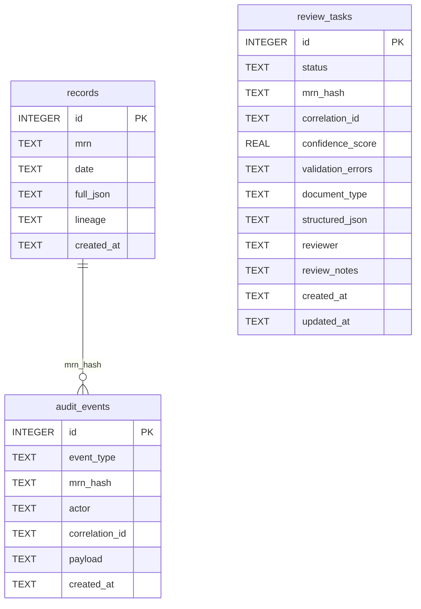

# Architecture

> **Purpose.** Code-level reference for how MediScan OCR is wired. The
> [handbook](HANDBOOK.md) is the reading order; this document is the
> map you keep open while reading code.

## Module dependency graph

```mermaid
flowchart TB
    main[backend/main.py]
    sec[backend/security.py]
    log[backend/logging_config.py]
    obs[backend/observability.py]
    lin[backend/lineage.py]
    pii[backend/pii_scrub.py]
    ext[backend/extract.py]
    ocr[backend/ocr.py]
    backends[backend/ocr_backends/*]
    graph[backend/workflows/extraction_graph.py]
    agent[backend/workflows/agentic_extraction.py]
    logic[backend/logic.py]
    ai[backend/ai_wrapper.py]
    art[backend/artifacts.py]
    db[backend/database.py]
    ret[backend/retrieval/__init__.py]
    chunks[backend/retrieval/chunking.py]
    emb[backend/retrieval/embeddings.py]
    qd[backend/retrieval/qdrant_store.py]
    pg[backend/retrieval/pgvector_store.py]
    vs[backend/retrieval/vector_store.py]
    mod[backend/models.py]

    main --> sec
    main --> log
    main --> obs
    main --> ext
    main --> graph
    main --> agent
    main --> logic
    main --> art
    main --> db
    main --> lin
    main --> ret
    main --> mod
    sec --> log
    ext --> ai
    ext --> ocr
    ext --> art
    ext --> log
    ext --> pii
    ext --> sec
    ext --> chunks
    ocr --> backends
    ocr --> art
    backends --> sec
    backends --> log
    graph --> ai
    graph --> db
    graph --> log
    graph --> ext
    graph --> logic
    graph --> mod
    graph --> ret
    graph --> chunks
    graph --> sec
    agent --> ext
    agent --> logic
    agent --> db
    agent --> ret
    agent --> chunks
    logic --> ai
    logic --> log
    logic --> chunks
    logic --> sec
    ai --> log
    ai --> obs
    ret --> chunks
    ret --> emb
    ret --> qd
    ret --> pg
    qd --> emb
    qd --> vs
    qd --> log
    pg --> vs
    chunks --> vs
    db --> log
    art --> log
    obs --> log
    obs --> sec
    lin --> sec
```

## Process startup

`backend/main.py:78` defines the FastAPI lifespan. At boot:

1. `ensure_upload_root()` ensures `MEDISCAN_UPLOAD_ROOT` exists.
2. `init_db()` creates the SQLite tables (`backend/database.py:71-127`).
3. The app refuses to start if `MEDISCAN_API_KEY` is set to the
   well-known placeholder (`backend/main.py:83-88`).
4. The granular and agentic graphs are warmed up
   (`backend/main.py:91-97`) so the first request doesn't pay
   compile-time cost.
5. `create_vector_store()` is touched at boot to surface Qdrant
   misconfiguration early (`backend/main.py:99-103`).

## The /analyze request lifecycle

The route is in `backend/main.py:276-466`. The flow:

| Step | Code | Purpose |
|---|---|---|
| Form value resolution | `backend/main.py:297-315` | Treat empty multipart strings as `None`; resolve API keys through `_api_key_for` (server env wins; client override only when `MEDISCAN_ALLOW_USER_API_KEYS=1`). |
| Upload save | `backend/main.py:317-323` | Stream the upload with `write_upload_with_limit` (magic bytes, byte cap, sanitized filename). |
| Workflow dispatch | `backend/main.py:327-422` | Pick one of `run_extraction_graph`, `run_agentic_extraction_workflow`, or `_call_document_pipeline` (direct). |
| Response assembly | `backend/main.py:437-456` | Wrap OCR payload, bboxes, and artifact URLs into the contract the UI consumes. |
| Audit | `backend/main.py:458-465` | Append `analyze_complete` to `audit_events`. |

## Workflow internals

| Workflow | Build / run | Cached compiled graph |
|---|---|---|
| Granular | `backend/workflows/extraction_graph.py:92` | `backend/workflows/extraction_graph.py:89, 137` |
| Agentic | `backend/workflows/agentic_extraction.py:58` | `backend/workflows/agentic_extraction.py:31, 82` |
| Direct | `backend/extract.py:46` | (no graph) |

## LLM dispatch

`backend/ai_wrapper.py:291` (`get_ai_response`) is the single entry
point. Provider clients are cached at module scope so HTTP connection
pools are reused across requests:

- OpenAI: `backend/ai_wrapper.py:168`
- Anthropic: `backend/ai_wrapper.py:173`
- Gemini (google-genai SDK): `backend/ai_wrapper.py:178`

Tenacity retries are configured to skip auth / validation errors and
retry only transient network, timeout, 429, and 5xx failures
(`backend/ai_wrapper.py:79-108`).

`parse_model_json` (`backend/ai_wrapper.py:427`) is the resilient JSON
parser. It tries, in order:

1. Direct `json.loads` on the trimmed text.
2. Content of any ```` ```json ... ``` ```` fence.
3. The longest balanced `{...}` substring.
4. The longest balanced `[...]` substring whose first element is a dict.

## Vector store contract

`VectorStoreBackend` is the abstract interface
(`backend/retrieval/vector_store.py:40-47`):

```python
class VectorStoreBackend(ABC):
    @abstractmethod
    def upsert_chunks(self, chunks: list[RetrievalChunk]) -> dict[str, Any]: ...

    @abstractmethod
    def search(
        self, query: str, limit: int = 5, filters: dict[str, Any] | None = None
    ) -> list[dict[str, Any]]: ...
```

`RetrievalChunk.to_payload()` (`backend/retrieval/vector_store.py:23-37`)
is the canonical payload schema. `QdrantRetrievalStore` is the only
live implementation; `PgvectorRetrievalStore` is a documented scaffold
(`backend/retrieval/pgvector_store.py:9-31`).

## SQLite schema

Tables created by `init_db` (`backend/database.py:71-127`):



## Frontend &harr; backend contract

The Streamlit client (`frontend/app.py`) sends `multipart/form-data`
with the fields documented in [USAGE.md](../USAGE.md#api-reference) and
attaches `X-API-Key` from the `MEDISCAN_API_KEY` env var
(`frontend/app.py:30`). Responses are interpreted by name:

| Response field | UI use |
|---|---|
| `extracted` | `st.data_editor` (Tab 1, right column) |
| `analysis` | Alerts + trends metrics + summary (Tab 2) |
| `bounding_boxes` | Dataframe (Tab 1 &middot; Bounding Boxes) |
| `annotated_image_urls` / `annotated_pdf_url` | Annotated tab |
| `vector_index_status` | "Retrieval Index" JSON block |
| `requires_human_review` | Warning banner at the top of Tab 1 |
| `correlation_id` | Echoed back into logs for support requests |

## Where to read next

- [Handbook &sect;3 &mdash; System architecture](HANDBOOK.md#3-system-architecture)
- [SECURITY.md](SECURITY.md) &mdash; threat model and defense-in-depth
- [DEVELOPMENT.md](DEVELOPMENT.md) &mdash; how to add a backend, test, and ship
