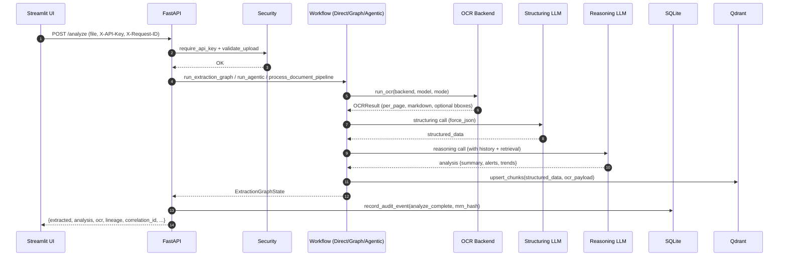
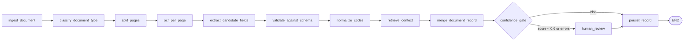

# MediScan OCR &mdash; Zero-to-Hero Handbook

> **Audience.** A new contributor or operator who needs to understand
> MediScan OCR deeply enough to extend it, debug it, or run it in production.
> Every section follows the same five-part structure: **definition**,
> **why**, **how it works** (concepts), **how the code implements it** (with
> file:line references), and **what the real outputs look like**.

[TOC]

---

## 1. What is MediScan OCR?

**Definition.** MediScan OCR is an end-to-end **clinical decision-support
system (CDSS)** that ingests unstructured medical documents, converts them
into a typed `MedicalRecord` via a multi-stage OCR + LLM pipeline, and
exposes that record for downstream reasoning, insurance verification, and
audit.

It is a single FastAPI service backed by:

| Concern | Choice | Why |
|---|---|---|
| API framework | FastAPI 0.115+ | Async, typed request/response, OpenAPI generation |
| Workflow engine | LangGraph 0.2+ | Per-node observability, conditional routing, persistent state |
| OCR (default) | GLM-OCR via Ollama | Local, no per-page cost, prompt-mode flexibility |
| OCR (alt) | PaddleOCR-VL (local Python or HTTP service) | Bbox support, layout JSON |
| LLM providers | Ollama, OpenAI, Anthropic, Gemini | Per-stage provider routing (structuring vs reasoning) |
| Relational store | SQLite (WAL, secure_delete) | Zero-config persistence, audit log, review queue |
| Vector store | Qdrant (active), pgvector (scaffold) | Semantic retrieval by patient MRN |
| UI | Streamlit | Operator console, no JS build step |

## 2. Why build it?

| Pain | MediScan's mechanism | Code |
|---|---|---|
| Paper/PDF clinical records are unusable downstream | OCR &rarr; LLM structuring &rarr; Pydantic-validated `MedicalRecord` &rarr; SQLite | `backend/extract.py:46` |
| LLM output is noisy and frequently off-schema | 12-node LangGraph with explicit validate &rarr; normalize &rarr; confidence_gate | `backend/workflows/extraction_graph.py:92` |
| Clinicians need prior-encounter context | SQLite history + Qdrant semantic retrieval by MRN hash | `backend/workflows/extraction_graph.py:381` |
| Insurance eligibility is a separate workflow | `/check_insurance` with prompt-firewalled policy ingestion and explainable verdicts | `backend/logic.py:136` |
| PHI must not leak to logs or external services | Structlog redactor + HMAC-peppered MRN hashing + nonce-delimited prompt firewall | `backend/logging_config.py:65`, `backend/retrieval/__init__.py:27`, `backend/security.py:255` |
| Different document types need different OCR | Pluggable `BaseOCRBackend`; three implementations behind one dispatcher | `backend/ocr_backends/base.py:78` |
| Reasoning quality must be reproducible | Lineage (git SHA, lib versions, OCR/LLM identifiers) embedded on every record | `backend/lineage.py:59` |

## 3. System architecture

### 3.1 Request lifecycle for `/analyze`



### 3.2 Code map

| Layer | File | What lives here |
|---|---|---|
| Entry point | `backend/main.py:112` | FastAPI app, lifespan, CORS, rate limit, observability wiring |
| Routes | `backend/main.py:276-619` | `/analyze`, `/check_insurance`, `/confirm`, `/artifacts/*`, `/review/*`, `/health`, `/ready` |
| Auth & upload | `backend/security.py:28-145` | API-key check, suffix allow-list, magic-byte validation, byte cap |
| Prompt firewall | `backend/security.py:255-293` | Nonce-delimited untrusted-content wrappers + firewall clause |
| OCR dispatch | `backend/ocr.py:14` | `run_ocr` + `materialize_annotations` |
| OCR backends | `backend/ocr_backends/{base,ollama_ocr,paddleocr_vl,service_client}.py` | Pluggable backends; Ollama-backed paths use `AsyncClient` with bounded concurrency |
| Extraction | `backend/extract.py:46` | Direct pipeline: OCR &rarr; structuring LLM |
| Granular graph | `backend/workflows/extraction_graph.py:92` | 12-node LangGraph, cached compiled graph |
| Agentic graph | `backend/workflows/agentic_extraction.py:58` | First-gen coarser LangGraph |
| LLM adapter | `backend/ai_wrapper.py:291` | Provider dispatch with tenacity retries + balanced-brace JSON parser |
| Reasoning | `backend/logic.py:91,136` | `analyze_medical_logic`, `check_insurance_coverage` |
| Persistence | `backend/database.py:38-283` | SQLite, WAL, audit log, review queue |
| Models | `backend/models.py:175-195` | `MedicalRecord` (forgiving) + `MedicalRecordStrict` (persistence boundary) |
| Retrieval | `backend/retrieval/{__init__,chunking,embeddings,qdrant_store,vector_store,pgvector_store}.py` | HMAC hash, chunker, Ollama embedder, Qdrant store, ABC |
| Observability | `backend/observability.py:79,146` | Prometheus + request-ID middleware |
| Lineage | `backend/lineage.py:59` | Git SHA, package versions, model identifiers |
| Logging | `backend/logging_config.py:65,78` | Structlog + PHI redactor |
| PII scrub | `backend/pii_scrub.py:49` | Optional Presidio or regex-based scrubber |

### 3.3 Output shape &mdash; `/analyze` response

The response is built in `backend/main.py:437-456` and is the contract the
Streamlit UI consumes:

```json
{
  "extracted": {
    "patient":  {"full_name": "Jane Doe", "dob": "1970-04-12", "mrn": "M-001"},
    "encounter": {"date": "2026-01-15", "provider": "Dr. Smith", "facility": "Clinic A"},
    "clinical": {
      "diagnosis_list": ["Type 2 diabetes mellitus", "Hypertension"],
      "medications":    [{"name": "Metformin", "dosage": "500 mg", "frequency": "BID"}],
      "vitals":         {"bp": "138/86", "hr": "78", "temp": "98.6", "weight": "74 kg"}
    }
  },
  "analysis": {
    "summary": "Stable hypertensive; glycemic control improving.",
    "alerts":  ["BP trending up vs prior encounter"],
    "trends":  [{"metric": "BP", "status": "Worsening", "details": "120/80 -> 140/90"}],
    "_status": {"ok": true}
  },
  "history_available": true,
  "file_path": "/abs/path/to/upload.pdf",
  "file_url":  "/artifacts/abc123_upload.pdf",
  "ocr": {
    "backend": "glm", "model": "glm-ocr", "ocr_mode": "text",
    "per_page_results": [...],
    "bounding_boxes": [...],
    "annotations_metadata": {"page_count": 1, "has_bounding_boxes": false, "has_native_confidence": false}
  },
  "bounding_boxes": [],
  "annotated_pdf_path": null,
  "annotated_pdf_url":  null,
  "annotated_image_paths": [],
  "annotated_image_urls":  [],
  "page_image_urls": ["/artifacts/abc123_upload_artifacts/pages/page_0001.png"],
  "requires_human_review": false,
  "vector_index_status": {"indexed": true, "chunks": 4, "collection": "medical_documents", "store": "qdrant"},
  "retrieval_enabled":   true,
  "ocr_supports_bboxes": false,
  "correlation_id": "5e9b1c2d3a4f...",
  "lineage": {
    "git_sha": "89f02ee",
    "app_version": "0.1.0",
    "fastapi_version": "0.115.x",
    "langgraph_version": "0.2.x",
    "qdrant_client_version": "1.12.x",
    "ocr_backend": "glm",
    "ocr_model": "glm-ocr",
    "structuring_provider": "Ollama",
    "structuring_model": "glm-4.7-flash",
    "reasoning_provider": "Ollama",
    "reasoning_model": "glm-4.7-flash"
  }
}
```

---

## 4. OCR subsystem

### 4.1 Definition

The OCR subsystem converts uploaded PDFs and images into structured text
(`OCRResult` with per-page text, optional markdown, and bounding boxes).
Three backends are supported and chosen per request:

| Backend | Engine | Bounding boxes | Prompt modes |
|---|---|---|---|
| **GLM-OCR** (default) | Ollama | &mdash; | `text`, `ocr`, `table`, `figure`, `chart`, `formula` |
| **DeepSeek-OCR** | _removed_ | &mdash; | &mdash; | Replaced by GLM-OCR. |
| **PaddleOCR-VL** (local) | PaddlePaddle | Yes | &mdash; |
| **PaddleOCR-VL** (service) | HTTP client (vllm-server) | Yes | &mdash; |

### 4.2 Why three?

| Use case | Backend |
|---|---|
| Narrative clinical records, low cost, local | GLM-OCR (default) |
| Same, but a different prompt template is preferred | _removed &mdash; GLM-OCR only_ |
| Tables, figures, bboxes, structured layout JSON | PaddleOCR-VL (local or service) |

### 4.3 How it works (concepts)

1. The uploaded file lands in `backend/uploads/<uuid>_<filename>` after
   passing magic-byte and byte-cap checks (`backend/security.py:124`).
2. PDFs are rendered to PNG pages at the configured DPI (default 150)
   (`backend/artifacts.py:122`).
3. The dispatcher in `backend/ocr.py:14` selects an OCR backend from the
   `OCRBackendConfig`. The same `OCRResult` schema is produced regardless of
   backend.
4. Ollama-backed paths run **concurrently** per page with a bounded
   semaphore (`backend/ocr_backends/ollama_ocr.py:39, 107`). This is
   configurable via `MEDISCAN_OLLAMA_CONCURRENCY`.
5. Per-page text is aggregated into a single `OCRResult` with optional
   `bounding_boxes`, `confidence`, and `annotations_metadata`
   (`backend/ocr_backends/base.py:90`).
6. If the backend emitted boxes, the artifact engine draws red polygons and
   label captions on the rendered page images and produces a PDF
   (`backend/artifacts.py:159, 244`).

### 4.4 How the code implements it

- `OCRResult` and `OCRPageResult` (Pydantic) are the unified output schema
  &mdash; `backend/ocr_backends/base.py:27-50`.
- `OCRBackendConfig.normalized_backend` maps `glm` / `ollama` / `paddle` /
  free-form aliases onto the registered backends
  &mdash; `backend/ocr_backends/base.py:64`.
- GLM-OCR is the only Ollama-backed OCR engine; its prompt templates
  are selected by `config.ocr_mode` inside a single `OllamaOCRBackend`
  &mdash; `backend/ocr_backends/ollama_ocr.py:20-27, 144-148`.
- The `ollama` Python SDK is imported at module level in
  `backend/ocr_backends/ollama_ocr.py:15` and `backend/extract.py:8`.
- PaddleOCR-VL has a process-wide LRU cache for the local pipeline to avoid
  reloading weights per request &mdash;
  `backend/ocr_backends/paddleocr_vl.py:37`.
- The Paddle service-mode client validates the URL through the SSRF guard
  before any network call &mdash; `backend/ocr_backends/service_client.py:66`.

### 4.5 Real outputs

- **GLM-OCR** &mdash; text-only: `raw_text` and `markdown` are
  populated, `bounding_boxes` and `confidence` are empty. The UI hides the
  Annotated, Overlay, and Bounding Boxes tabs (`frontend/app.py:276, 294`).
- **PaddleOCR-VL** &mdash; per-page `bounding_boxes` and aggregated
  `confidence` are populated; `structured_doc.pages[i]` contains layout
  JSON. Annotated PNGs and a multi-page `annotated_document.pdf` are
  written to `<upload>_artifacts/annotations/`.
- The `/analyze` response's `ocr_supports_bboxes` field is computed in
  `backend/main.py:453` and is `true` only for PaddleOCR-VL.

---

## 5. Extraction workflows

### 5.1 Definition

An **extraction workflow** is the orchestration that takes an uploaded
document and produces a `MedicalRecord` plus a `clinical analysis`. Three
are shipped:

- **Direct pipeline** &mdash; OCR &rarr; structuring LLM (single call) &rarr; reasoning LLM.
- **Granular extraction graph** &mdash; 12-node LangGraph with explicit
  per-node observability and a confidence-gated human-review branch.
- **Agentic workflow** &mdash; first-generation LangGraph with coarser
  composite nodes; kept for backward compatibility.

### 5.2 Why three?

| Constraint | Workflow that fits |
|---|---|
| Lowest latency, high-trust document type | Direct pipeline |
| Need per-node tracing, validation, and review routing | Granular graph (default) |
| Existing callers / regression tests depend on the legacy contract | Agentic workflow |

### 5.3 How it works (concepts)

- **Direct pipeline.** `process_document_pipeline` (in
  `backend/extract.py:46`) calls `run_document_ocr`, builds a prompt with the
  prompt firewall, calls the structuring LLM, parses the JSON response, and
  returns. Retrieval, history lookup, and indexing are run by the route
  handler in `backend/main.py:405-422`.
- **Granular graph.** Built in `backend/workflows/extraction_graph.py:92`.
  The compiled graph is cached at module scope and reused across requests
  (`backend/workflows/extraction_graph.py:89, 137`). The
  `ExtractionGraphState` is a `TypedDict` (`extraction_graph.py:49`).
- **Agentic graph.** Built in `backend/workflows/agentic_extraction.py:58`.
  Same module-scope compile-cache pattern.

The 12-node granular graph (see `backend/workflows/extraction_graph.py:99-132`):



### 5.4 How the code implements it

- The 12 nodes live in `backend/workflows/extraction_graph.py:193-553`.
- `_confidence_gate_node` (`extraction_graph.py:438`) combines:
  schema-validation error count, presence of OCR text, OCR-reported
  confidence, and presence of patient/encounter/clinical sections.
- `_human_review_node` (`extraction_graph.py:464`) currently emits an
  audit event and enqueues a SQLite review task
  (`backend/database.py:218`). A production deployment should use
  LangGraph's `interrupt()` + a durable checkpointer to pause and resume.
- `_persist_record_node` (`extraction_graph.py:513`) builds
  `RetrievalChunk`s from the OCR payload and upserts them into the
  configured vector store. Falls back to indexing the structured JSON if
  the OCR payload produced no chunks.

### 5.5 Real outputs

The granular graph's final state is returned to the route handler and used
to assemble the `/analyze` response (see &sect;3.3). On
`requires_human_review=true`, the response includes
`vector_index_status: {indexed: false, reason: "Pending human review"}` and
the caller should fetch the review task via
`GET /review/pending?limit=50`.

---

## 6. Clinical reasoning &amp; insurance verification

### 6.1 Definition

`analyze_medical_logic` and `check_insurance_coverage` in
`backend/logic.py` wrap the reasoning LLM in a strict prompt contract and
return a JSON object that the frontend can render directly.

### 6.2 Why a separate module?

LLM calls need a stable schema, prompt firewall, and a single sanitization
boundary. Putting both flows behind one module keeps the boundary in one
place and makes the reasoning prompts easy to audit and version.

### 6.3 How it works

- **Reasoning** (see `backend/logic.py:91`): builds three untrusted sections
  (`CURRENT_DATA`, `PAST_DATA`, `RETRIEVED_CONTEXT`), wraps each with a
  random nonce (`generate_boundary_nonce`), appends the firewall clause to
  the system prompt, calls the LLM with `force_json=True`, and parses
  through `parse_model_json` (a balanced-brace scanner that survives stray
  prose).
- **Insurance** (see `backend/logic.py:136`): same pattern, with the policy
  text truncated to 8 000 chars and policy chunks (if any) wrapped as
  `RETRIEVED_POLICY_CONTEXT`.
- **Failure handling**: `AIProviderError` and parse failures return a
  stable schema with `_status: {ok: false, reason: ...}` so the UI can
  distinguish silent failure from "no alerts" (`backend/logic.py:69-88`).

### 6.4 Real outputs

Reasoning (`backend/logic.py:91-133`):

```json
{
  "summary": "BP elevated compared to prior encounter; no new critical alerts.",
  "alerts":  ["BP trending up vs prior encounter"],
  "trends":  [{"metric": "BP", "status": "Worsening", "details": "120/80 -> 140/90"}],
  "_status": {"ok": true}
}
```

Insurance (`backend/logic.py:136-179`):

```json
{
  "eligible":     true,
  "confidence":   "High",
  "reasoning":    "Type 2 diabetes is listed as a covered condition under Section 4(b).",
  "missing_info": [],
  "_status":      {"ok": true}
}
```

---

## 7. Persistence, audit, and the review queue

### 7.1 Definition

SQLite stores three things: confirmed `MedicalRecord` rows, a
tamper-evident `audit_events` log, and a `review_tasks` queue for documents
the extraction graph routed to a human.

### 7.2 Why SQLite first?

- Zero-config deployment; the file is portable.
- WAL + `synchronous=NORMAL` gives many readers + one writer with bounded
  fsync cost.
- `PRAGMA secure_delete=ON` zeroes freed pages so deleted MRNs don't linger
  on disk.
- `PRAGMA trusted_schema=OFF` closes CVE-2020-9327 / CVE-2020-13434-style
  attacks from untrusted extensions.

### 7.3 How the code implements it

- Connection setup &mdash; `backend/database.py:38-68`.
- Tables and indices &mdash; `backend/database.py:71-127`.
- `save_record` enforces a 256 KiB payload cap
  (`backend/database.py:27, 152-154`).
- `get_patient_history` returns the **latest** prior record per MRN
  (`backend/database.py:171-188`); a full longitudinal view is on the
  roadmap.
- `enqueue_review_task` and `list_pending_reviews` back the `/review/*`
  routes (`backend/database.py:218-270`).

### 7.4 Real outputs

A `records` row (after a `/confirm` call):

```json
{
  "id": 42,
  "mrn": "M-001",
  "date": "2026-01-15",
  "full_json": "{...MedicalRecord JSON...}",
  "lineage":   "{\"git_sha\": \"89f02ee\", ...}",
  "created_at": "2026-01-15 12:34:56"
}
```

A `review_tasks` row:

```json
{
  "id": 7,
  "status": "pending",
  "mrn_hash": "<HMAC-SHA256(MRN, MRN_HMAC_PEPPER)>",
  "confidence_score": 0.42,
  "validation_errors": ["clinical.diagnosis_list: field required"],
  "document_type": "medical_record",
  "structured_json": "{...}",
  "created_at": "2026-01-15 12:34:56"
}
```

> MRNs are never persisted in cleartext. The HMAC is computed in
> `backend/retrieval/__init__.py:27`; without `MRN_HMAC_PEPPER`, the
> function returns `None` and the audit / retrieval path silently no-ops.

---

## 8. Semantic retrieval

### 8.1 Definition

Qdrant stores document chunks as dense vectors with deterministic
metadata. Two flows use it:

1. **Patient history (read).** During extraction, the reasoning LLM
   receives the top-k chunks whose `patient_id_hash` and `source_type`
   match the current record.
2. **Document indexing (write).** After a confirmed extraction, chunks
   from the OCR payload (or the structured JSON as fallback) are upserted
   into the same collection.

### 8.2 Why Qdrant?

- Native payload filters &mdash; exact metadata match runs before similarity
  scoring.
- Embedded mode available for dev; standalone server for prod.
- The `query_points` API is the modern replacement for the deprecated
  `search` (removed in Qdrant 1.18).

### 8.3 How the code implements it

- `VectorStoreBackend` ABC &mdash; `backend/retrieval/vector_store.py:40`.
- `QdrantRetrievalStore` &mdash; `backend/retrieval/qdrant_store.py:56`.
  Refuses to connect anonymously to a remote Qdrant
  (`qdrant_store.py:62-67`).
- `embed_texts` uses the modern `embed` endpoint with a fallback to
  `embeddings` &mdash; `backend/retrieval/embeddings.py:25`.
- `hash_identifier` (HMAC-SHA256) &mdash; `backend/retrieval/__init__.py:27`.
  No weak-hash fallback is provided by design.
- Prompt-injection scrubber for retrieved chunks
  &mdash; `backend/retrieval/chunking.py:33-38` (defense in depth on top of
  the boundary-nonce firewall).

### 8.4 Real outputs

`qdrant_store.upsert_chunks` returns:

```json
{
  "indexed":   true,
  "chunks":    4,
  "collection": "medical_documents",
  "store":     "qdrant"
}
```

`qdrant_store.search` returns a list of:

```json
{
  "score":       0.87,
  "text":        "Page 2 narrative...",
  "page_number": 2,
  "source_ref":  "/abs/path/.../page_0002.png",
  "payload":     {"... all stored fields ..."}
}
```

---

## 9. Security

### 9.1 Definition

Defense in depth: every data route requires the API key, every upload is
validated by suffix + magic bytes + byte cap, every outbound URL is
checked by the SSRF guard, every MRN is HMAC-hashed, and every untrusted
document section is wrapped in a nonce-delimited block with a
firewall-clause system prompt.

### 9.2 Why so many layers?

A single layer can be defeated by a single bug. Stacking them means a
failure in one layer is contained by the next. See
[docs/SECURITY.md](SECURITY.md) for the full threat model and code
references.

### 9.3 How the code implements it

- API-key check &mdash; `backend/security.py:28-47`. Constant-time
  comparison via `hmac.compare_digest`.
- Upload validation &mdash; `backend/security.py:86-145`. Rejects
  path-traversal in filenames (`sanitize_filename`),
  unsupported suffixes (415), oversized uploads (413), and
  magic-byte mismatches (415).
- SSRF guard &mdash; `backend/security.py:198-247`. Resolves the URL via
  `socket.getaddrinfo` and rejects loopback, multicast, link-local, and
  private IPs unless the operator opts in. Used by the PaddleOCR-VL
  service client.
- Prompt firewall &mdash; `backend/security.py:255-293`. Every untrusted
  payload is wrapped as `<<<UNTRUSTED_DOCUMENT_<nonce>_BEGIN>>>` /
  `_END>>>` and the system prompt is augmented with a firewall clause that
  references the same nonce. This is wired into both the structuring call
  (`backend/extract.py:36-43`) and the reasoning call
  (`backend/logic.py:101, 118, 147, 164`).
- PHI redactor &mdash; `backend/logging_config.py:65-72`. Redacts known
  sensitive keys (`mrn`, `dob`, `full_name`, `api_key`, ...) and Bearer
  / OpenAI / Anthropic tokens in any string field.
- Optional PII scrub &mdash; `backend/pii_scrub.py:49`. Skipped when the
  provider is Ollama (data never leaves the box).

### 9.4 Real outputs

- Auth failure: `401 Invalid or missing API key.`
- Wrong file type: `415 Unsupported file type: .exe`
- Magic-byte mismatch: `415 File contents do not match the declared MIME type.`
- SSRF attempt: `400 URL targets a private IP range.`
- Log line after a redactor scrub: `"event": "analyze_complete", "mrn": "<REDACTED>", "duration_ms": 412`

---

## 10. Observability

### 10.1 Definition

Three layers: structlog JSON logs with a PHI redactor, an optional
Prometheus `/metrics` endpoint, and an optional OpenTelemetry FastAPI
instrumentation. Per-request correlation IDs are accepted on ingress and
echoed on egress.

### 10.2 Why all three?

- **Logs** are the on-host forensic trail; they must be structured and
  free of PHI.
- **Metrics** are what SLOs and alerts are built on; they must be cheap
  enough to record on every request.
- **Traces** are how you debug a slow request across the LLM call
  boundary; OpenTelemetry keeps the wire format portable.

### 10.3 How the code implements it

- `configure_logging` is idempotent and called from `main.py:68` &mdash;
  `backend/logging_config.py:78-105`.
- The request-context middleware binds `request_id`, `method`, `path`
  into structlog contextvars and records the Prometheus latency histogram
  &mdash; `backend/observability.py:146-202`.
- LLM call duration is observed by `record_llm_call` &mdash;
  `backend/observability.py:79`. This is wired in
  `ai_wrapper.get_ai_response` (`backend/ai_wrapper.py:370-379`) so every
  provider call is measured.
- `MEDISCAN_PROMETHEUS=1` mounts `/metrics` behind `X-API-Key` auth
  &mdash; `backend/observability.py:121`.
- `MEDISCAN_OTEL=1` enables `FastAPIInstrumentor.instrument_app` &mdash;
  `backend/observability.py:133-140`.

### 10.4 Real outputs

A structlog line (formatted by `JSONRenderer`):

```json
{"event": "llm_call", "provider": "ollama", "model": "glm-4.7-flash", "duration_ms": 412, "status": "ok", "timestamp": "2026-01-15T12:34:56.789Z", "level": "info"}
```

A `/metrics` scrape (when Prometheus is enabled) includes:

```
mediscan_request_latency_seconds_bucket{method="POST",path="/analyze",status="200",le="0.5"}  3
mediscan_llm_call_duration_seconds_count{provider="ollama",model="glm-4.7-flash",status="ok"}  17
```

---

## 11. From zero to your first extraction

```bash
# 1. Clone
git clone https://github.com/pypi-ahmad/Clinical-Decision-Support-System.git
cd Clinical-Decision-Support-System

# 2. venv + dependencies
python -m venv .venv
source .venv/bin/activate          # Windows: .venv\Scripts\Activate.ps1
pip install -r requirements.lock.txt

# 3. Required secrets
export MEDISCAN_API_KEY="$(python -c 'import secrets; print(secrets.token_urlsafe(32))')"
export MRN_HMAC_PEPPER="$(python -c 'import secrets; print(secrets.token_urlsafe(32))')"
# For local dev only:
# export MEDISCAN_ALLOW_ANONYMOUS=1

# 4. Local services
ollama serve &
ollama pull glm-ocr
ollama pull glm-4.7-flash
# Optional: docker run -p 6333:6333 qdrant/qdrant:v1.12.4

# 5. Run
uvicorn backend.main:app --reload --port 8000   # Terminal 1
streamlit run frontend/app.py                    # Terminal 2

# 6. Smoke test
curl -s -X POST http://localhost:8000/analyze \
  -H "X-API-Key: $MEDISCAN_API_KEY" \
  -F "file=@sample.pdf" \
  -F "ocr_backend=glm" -F "ocr_mode=text" \
  -F "structuring_provider=Ollama" -F "structuring_model=glm-4.7-flash" \
  -F "reasoning_provider=Ollama"   -F "reasoning_model=glm-4.7-flash" \
  | jq .
```

What you should see: a 200 response with `extracted`, `analysis`, `ocr`,
`lineage`, and `correlation_id` fields (see &sect;3.3 for the full shape).

---

## 12. Where to read next

| You want to ... | Read |
|---|---|
| Understand the system end-to-end | this handbook (you are here) |
| See the code-level architecture | [docs/ARCHITECTURE.md](ARCHITECTURE.md) |
| Audit the security model | [docs/SECURITY.md](SECURITY.md) |
| Add a feature, run tests, or update CI | [docs/DEVELOPMENT.md](DEVELOPMENT.md) |
| Look up an environment variable or a route | [USAGE.md](../USAGE.md) |
| See the operator-facing minimum path | [README.quickstart.md](../README.quickstart.md) |
| Check the test counts and coverage | [TEST_REPORT.md](../TEST_REPORT.md) |
